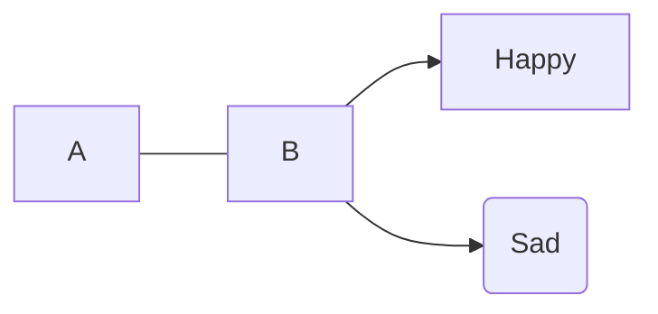
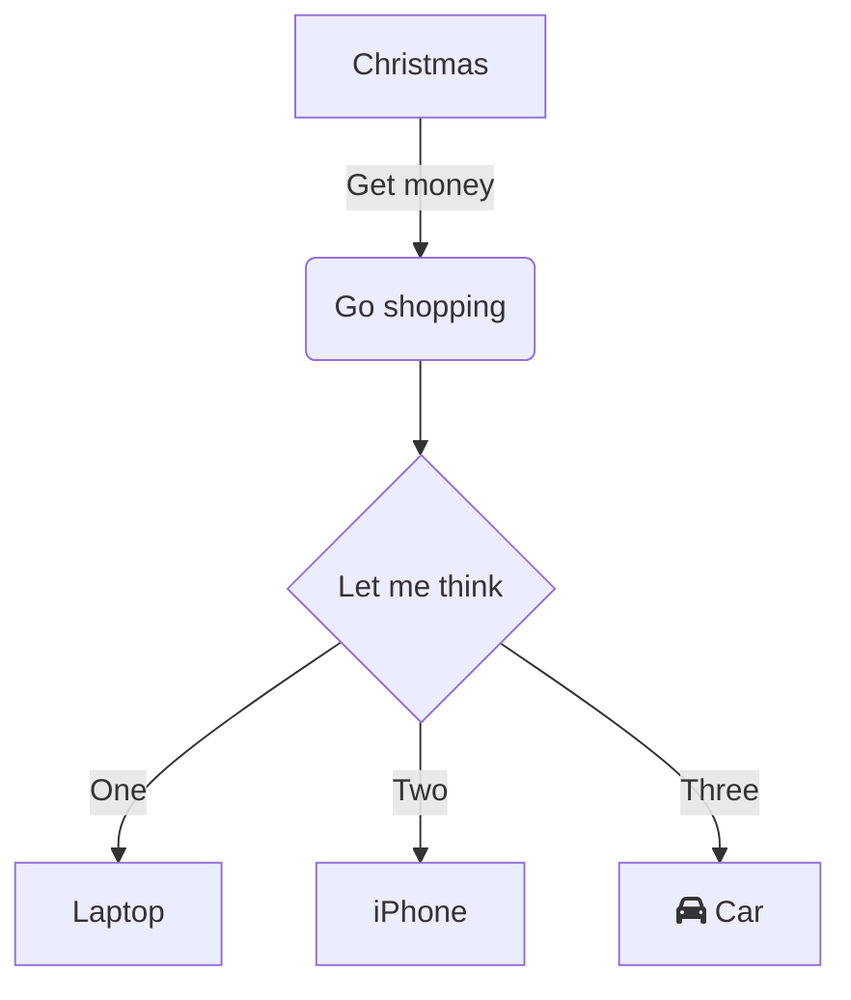
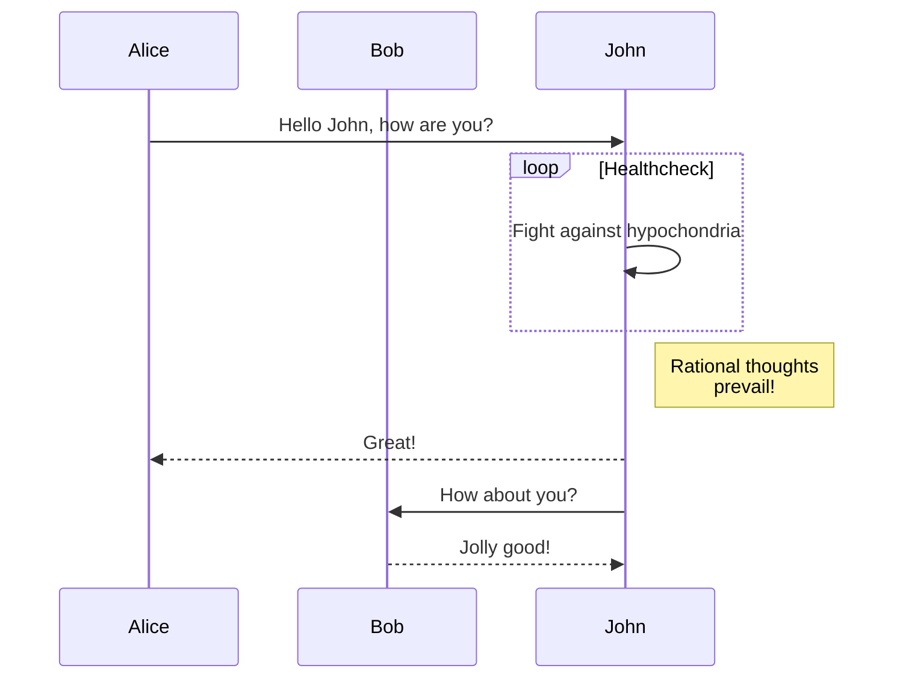
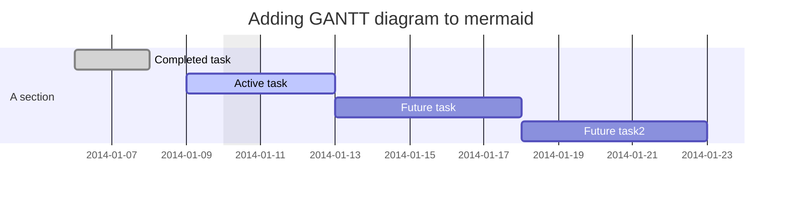
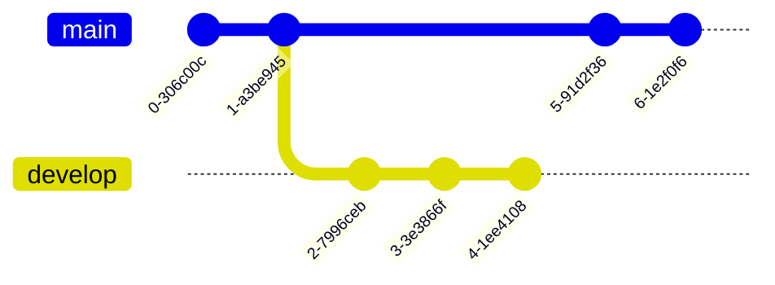
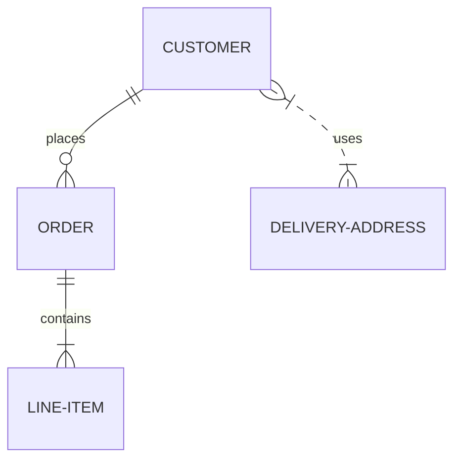

tttest!! samplae

> The content of this post applies only to [_Universal Analytics property_](https://support.google.com/analytics/answer/10220206) (UA), not [_Google Analytics 4_](https://support.google.com/analytics/answer/10089681) (GA 4). In addition, since [UA is about to be deprecated on Jul 1, 2023](https://support.google.com/analytics/answer/11583528), the Page Views feature of [_Chirpy_][chirpy-homepage] will also be deprecated at that time.
{: .prompt-danger }

This post is to enable Page Views on the [**Chirpy**][chirpy-homepage] theme based blog that you just built. This requires technical knowledge and it's recommended to keep the `google_analytics.pv.*` empty unless you have a good reason. If your website has low traffic, the page views count would discourage you to write more blogs. With that said, let's start with the setup.

[markdown diagram](https://mermaid.js.org/intro/)
https://jojozhuang.github.io/tutorial/jekyll-diagram-with-mermaid/

test sample!
## samlple test
Here is a simple flow chart:

  

classDiagram
Class01 <|-- AveryLongClass : Cool
Class03 *-- Class04
Class05 o-- Class06
Class07 .. Class08
Class09 --> C2 : Where am i?
Class09 --* C3
Class09 --|> Class07
Class07 : equals()
Class07 : Object[] elementData
Class01 : size()
Class01 : int chimp
Class01 : int gorilla
Class08 <--> C2: Cool label
  

  

journey
    title My working day
    section Go to work
      Make tea: 5: Me
      Go upstairs: 3: Me
      Do work: 1: Me, Cat
    section Go home
      Go downstairs: 5: Me
      Sit down: 5: Me
  

## Set up Google Analytics

### Create GA account and property

First, you need to set up your account on Google analytics. While you create your account, you must create your first **Property** as well.

1. Head to <https://analytics.google.com/> and click on **Start Measuring**
2. Enter your desired _Account Name_ and choose the desired checkboxes
3. Enter your desired _Property Name_. This is the name of the tracker project that appears on your Google Analytics dashboard
4. Enter the required information _About your business_
5. Hit _Create_ and accept any license popup to set up your Google Analytics account and create your property

### Create Data Stream

