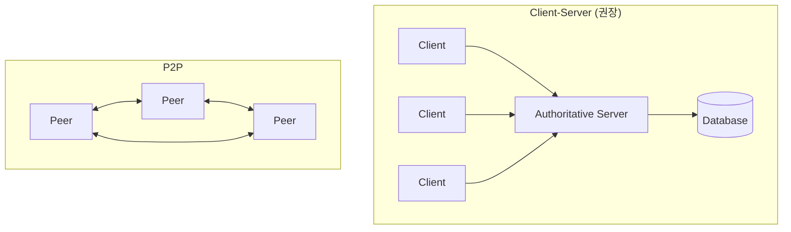
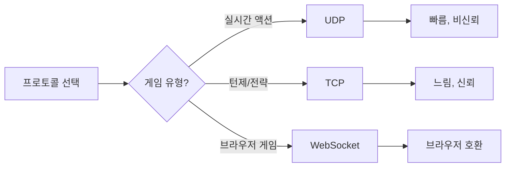
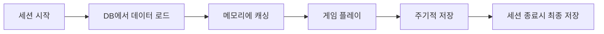

# 스타트업 게임회사 서버 개발자 가이드

> 게임서버는 뭐로 해야 하고, 디비는 뭐로 해야 하고??

스타트업 게임회사에서 서버 개발을 시작할 때 고민되는 부분들을 정리했습니다. 2026년 최신 트렌드를 반영하여 업데이트했습니다.

## 게임 서버 개발자가 알아야 할 기술 스택

### 프로그래밍 언어 선택

| 언어 | 특징 | 적합한 게임 유형 |
|------|------|------------------|
| **C++** | 최고 성능, 게임 업계 1급 언어 | 실시간 통신 게임, AAA |
| **C#** | Unity 연동, 높은 생산성 | 모바일, 인디 게임 |
| **Go** | 동시성 처리 우수, 간결함 | 매칭 서버, API 서버 |
| **Rust** | 메모리 안전성, 고성능 | 차세대 게임 서버 |
| **Node.js** | 빠른 프로토타이핑 | 소셜/캐주얼 게임 |

### C++ - 여전한 왕좌

게임 업계에서 **C++은 1급 프로그래밍 언어**입니다. 실시간 통신 게임 서버에 가장 많이 사용되며, 한국에서는 대부분 Windows 환경에서 실행됩니다.

```cpp
// 간단한 게임 서버 루프 예시
while (running) {
    ProcessNetworkEvents();
    UpdateGameState(deltaTime);
    BroadcastStateToClients();
    SleepForTargetTickRate();
}
```

### Rust - 주목받는 신흥 강자

Stack Overflow 설문조사에서 **2016년부터 매년 "가장 사랑받는 언어" 1위**를 달성하고 있습니다.

주요 채택 사례:
- **Discord**: 2020년 Go에서 Rust로 서버 전환
- **Amazon, Google, Microsoft, Meta**: 자사 서비스에 적극 활용
- **게임 엔진**: Fyrox3D, Bevy (Rust 기반 오픈소스 엔진)
- **Unreal-Rust**: UE5에서 사용 가능한 Rust 바인딩

## 멀티플레이어 게임 아키텍처

### 아키텍처 패턴 비교



### Client-Server 모델 (권위적 서버)

**모든 게임 로직이 중앙 서버에서 실행**됩니다.

```
클라이언트 → 입력 전송 → 서버
서버 → 게임 실행 → 결과 전송 → 클라이언트
```

장점:
- 치팅 방지에 효과적
- 일관된 게임 상태 유지

단점:
- 네트워크 지연에 민감
- 서버 비용 발생

### 2025-2026 트렌드: 탄력적 서버 아키텍처

> "2025년 멀티플레이어 아키텍처의 핵심은 **탄력적 서버 아키텍처(Elastic Server Architecture)**입니다."

플레이어 수에 따라 자동으로 리소스를 추가/제거하여 안정적인 게임플레이 경험을 보장합니다.

## 실시간 동기화 기법

### 핵심 기술들

| 기술 | 설명 |
|------|------|
| **Client-side Prediction** | 클라이언트가 서버 응답 전에 미리 예측 |
| **Lag Compensation** | 서버가 과거 상태로 히트 판정 |
| **Server Reconciliation** | 서버 결과로 클라이언트 상태 보정 |
| **Interpolation** | 스냅샷 간 부드러운 보간 |

### 프로토콜 선택



**실시간 게임은 대부분 UDP를 선호**합니다. TCP는 신뢰성이 높지만 속도가 느리기 때문입니다.

## 게임 백엔드 솔루션

### 주요 솔루션 비교

| 솔루션 | 특징 | 가격 모델 |
|--------|------|-----------|
| **AWS GameLift** | 26개 리전, 1억 CCU 지원 | 사용량 기반 |
| **Photon Engine** | 크로스플랫폼, 쉬운 통합 | 월정액 + CCU |
| **Nakama** | 오픈소스, 200만 CCU 테스트 완료 | 셀프호스팅 무료 |
| **PlayFab** | MS 지원, Azure 통합 | 무료 티어 있음 |

### AWS GameLift

Amazon GameLift Servers는 **26개 리전, 5개 대륙**에서 게임 서버를 배포할 수 있습니다.

- 2025년 2월 테스트에서 **단일 게임 1억 CCU** 처리 능력 입증
- Nakama, Pragma, AccelByte와 통합 지원
- Terraform, Pulumi로 IaC 배포 가능

### Nakama - 오픈소스 게임 서버

**세계적으로 인정받는 오픈소스 게임 서버**입니다.

```
주요 기능:
- 실시간 멀티플레이어
- 매치메이킹
- 리더보드
- 인앱 구매
- 소셜 기능
```

AWS에서 **200만 동시 접속 유저** 로드 테스트를 성공적으로 완료했습니다.

### Photon Engine

**크로스플랫폼 실시간 멀티플레이어 프레임워크**입니다.

주요 제품:
- **Photon Fusion**: 고성능 상태 동기화
- **Photon Quantum**: 완전 결정론적 엔진, 제로 랙 게임플레이

## 데이터베이스 선택

### 실시간 서버의 핵심 원칙

> **"실시간 서버에서 데이터베이스 접근은 절대 블로킹되면 안 됩니다."**

실시간 교환은 밀리초 단위 지연시간으로 측정됩니다. 데이터베이스 기반 블로킹은 플레이어 경험을 저하시킵니다.

### 권장 패턴



### 데이터베이스 유형별 용도

| 유형 | 솔루션 | 용도 |
|------|--------|------|
| **인메모리** | Redis, Memcached | 세션 데이터, 캐시 |
| **NoSQL** | MongoDB, DynamoDB | 유저 프로필, 인벤토리 |
| **RDBMS** | PostgreSQL, MySQL | 결제, 로그, 분석 |
| **시계열** | InfluxDB, TimescaleDB | 메트릭, 모니터링 |

## 인프라 & DevOps

### 2025-2026 필수 스택

```
AWS/GCP/Azure + Docker + Kubernetes
```

이 조합은 이제 **규모에 상관없이 많은 기업에서 기본 인프라 스택**으로 자리잡았습니다.

### 게임 서버 특화 고려사항

| 고려사항 | 설명 |
|----------|------|
| **Stateful Load Balancing** | 같은 세션의 플레이어는 같은 서버로 |
| **Zone 기반 할당** | MMORPG에서 존별로 서버 할당 |
| **글로벌 배포** | 낮은 레이턴시를 위한 리전 분산 |
| **오토스케일링** | 플레이어 수에 따른 탄력적 확장 |

## 네트워킹 라이브러리

### 추천 라이브러리

| 라이브러리 | 설명 |
|------------|------|
| **ENet** | 간단하고 견고한 신뢰성 있는 UDP |
| **GameNetworkingSockets** | Valve의 Steam 네트워크 전송 계층 |
| **GGPO** | 격투 게임용 롤백 네트워크 SDK |
| **KCP** | 빠르고 신뢰성 있는 ARQ 프로토콜 |
| **LiteNetLib** | C# 게임용 UDP 라이브러리 |

## 2026년 게임 서버 개발자 역량

### 필수 역량

1. **AI 활용 능력**: 자동화, 데이터 파이프라인 설계
2. **클라우드 네이티브**: AWS/GCP + Docker + K8s
3. **시스템 사고**: 전체 아키텍처 이해
4. **지속적 학습**: 빠르게 변화하는 기술 적응

### 2026년 채용 트렌드

> "2026년 채용의 핵심은 **실무 중심의 기술 역량, 다기능성, 지속적인 학습 능력**에 있습니다."

기업들은 단순히 코드를 작성하는 사람이 아니라 **AI를 다룰 줄 아는 개발자**를 원합니다.

## 스타트업에서의 현실적 조언

### 빠른 시작을 위한 추천 스택

```
게임 로직: C# (Unity) 또는 Go
실시간 통신: Photon 또는 Nakama
데이터베이스: Redis + PostgreSQL
인프라: AWS (GameLift 또는 EC2)
```

### 단계별 접근

1. **MVP 단계**: 관리형 서비스 (Photon, PlayFab) 활용
2. **성장 단계**: 하이브리드 (일부 커스텀 서버 도입)
3. **스케일 단계**: 완전 커스텀 또는 GameLift

### 비용 최적화 팁

- 초기에는 관리형 서비스로 빠르게 검증
- 트래픽이 예측 가능해지면 Reserved Instance 활용
- 비피크 시간대 서버 축소 자동화

## 결론

게임 서버 개발은 **일반 백엔드와 다른 고유한 도전**이 있습니다:

- 실시간성 (밀리초 단위 응답)
- 상태 관리 (Stateful 서버)
- 치팅 방지 (클라이언트 불신)
- 글로벌 서비스 (레이턴시 최적화)

하지만 좋은 소식은, 2025-2026년 현재 **Nakama, Photon, GameLift** 같은 성숙한 솔루션들이 있어 스타트업도 빠르게 멀티플레이어 게임을 출시할 수 있다는 것입니다.

> "게임의 백엔드는 단순한 인프라가 아닙니다. 플레이어 신뢰, 리텐션, 수익화의 숨은 영웅입니다."

---

## 참고 자료

- [AWS GameLift](https://aws.amazon.com/gamelift/)
- [Nakama Game Server](https://heroiclabs.com/nakama/)
- [Photon Engine](https://www.photonengine.com/)
- [Gabriel Gambetta - Client-Server Game Architecture](https://www.gabrielgambetta.com/client-server-game-architecture.html)
- [Awesome Game Networking (GitHub)](https://github.com/rumaniel/Awesome-Game-Networking)
- [Multiplayer Game Development Guide 2025](https://generalistprogrammer.com/tutorials/multiplayer-game-development-complete-networking-guide-2025)
