# Mermaid 다이어그램 완벽 가이드

Mermaid는 텍스트 기반으로 다이어그램을 그리는 JavaScript 라이브러리입니다. Markdown 문서에서 코드 블록으로 쉽게 다이어그램을 작성할 수 있습니다.

## 1. 플로우차트 (Flowchart)

### 기본 플로우차트

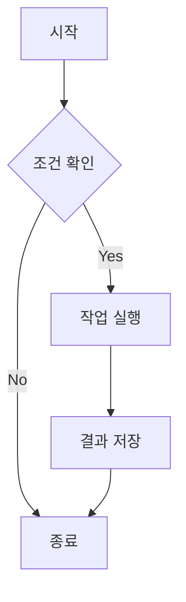

### 방향 설정

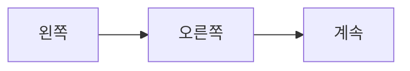

**방향 옵션:**
- `TD` / `TB`: 위에서 아래로 (Top-Down)
- `BT`: 아래에서 위로 (Bottom-Top)
- `LR`: 왼쪽에서 오른쪽으로
- `RL`: 오른쪽에서 왼쪽으로

### 다양한 노드 모양

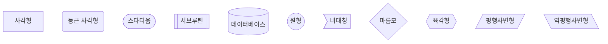

### 서브그래프

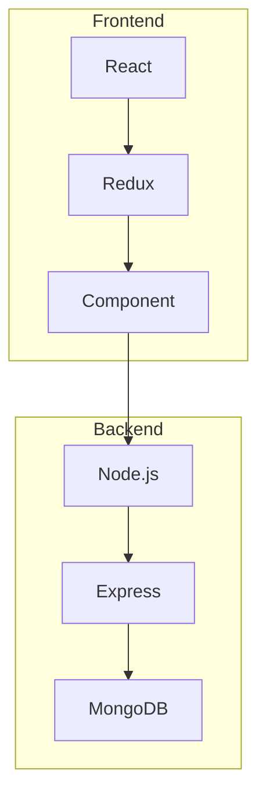

## 2. 시퀀스 다이어그램 (Sequence Diagram)

### 기본 시퀀스

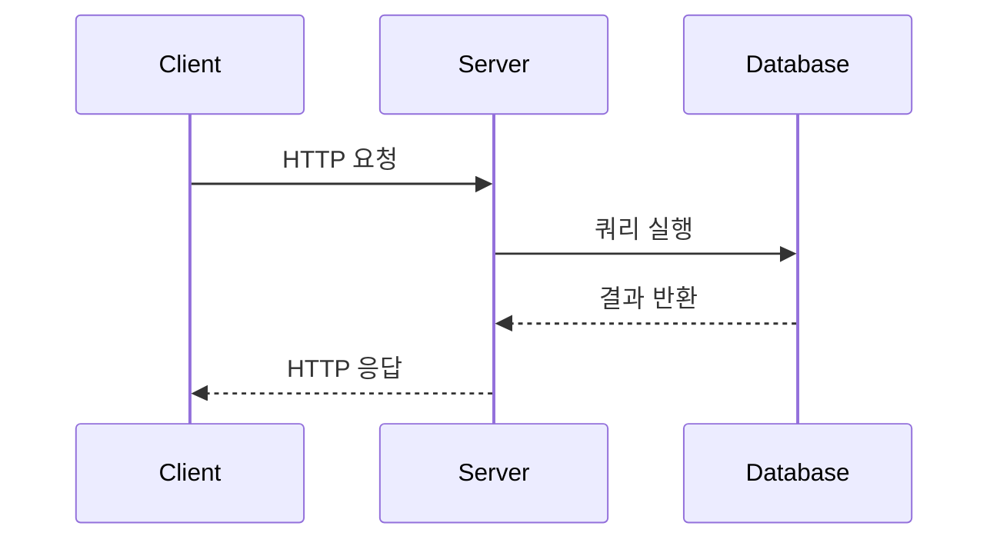

### 활성화와 노트

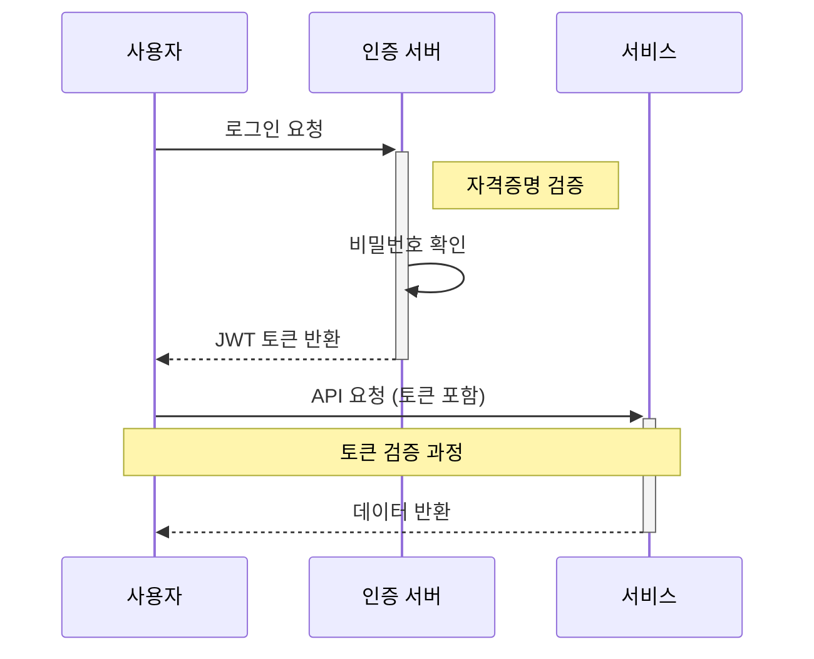

### 루프와 조건문

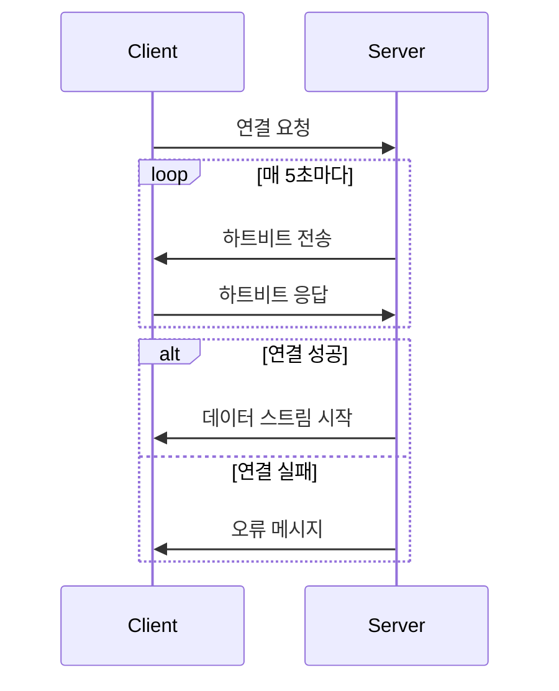

## 3. 클래스 다이어그램 (Class Diagram)

### 기본 클래스

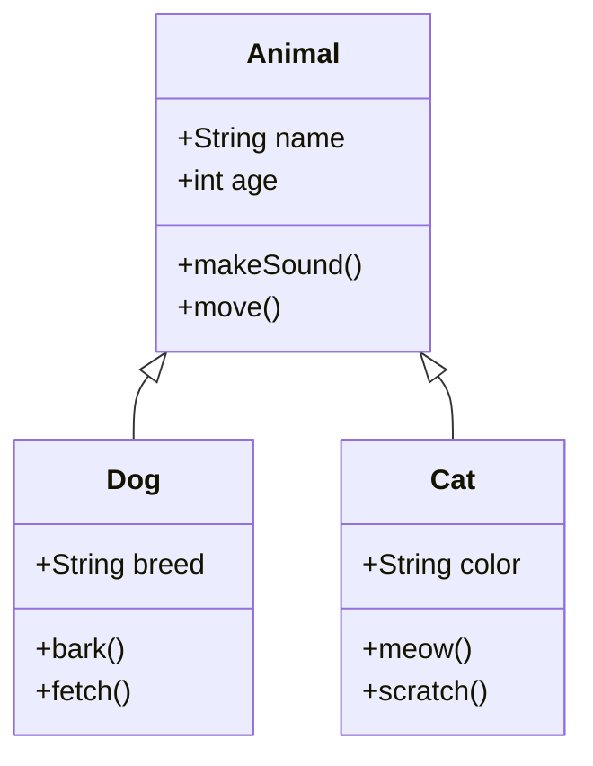

### 관계 표현

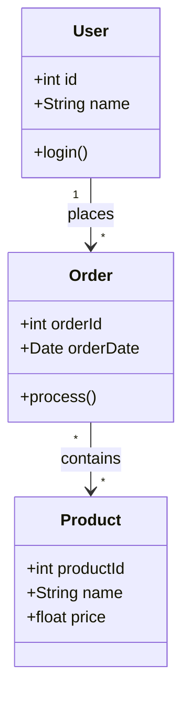

## 4. 상태 다이어그램 (State Diagram)

### 주문 상태

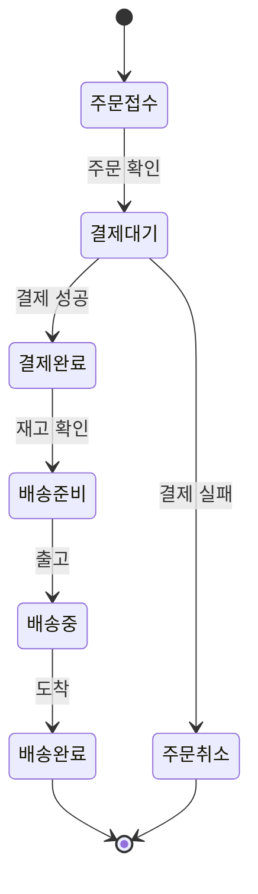

### 중첩 상태

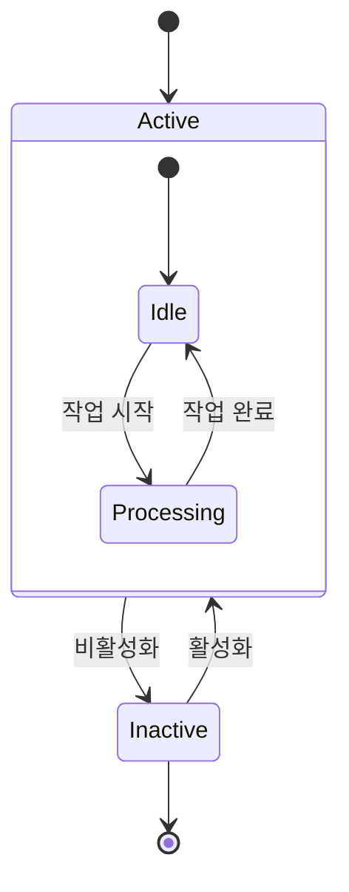

## 5. ER 다이어그램 (Entity Relationship)

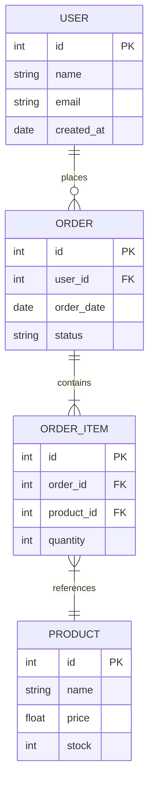

## 6. 간트 차트 (Gantt Chart)

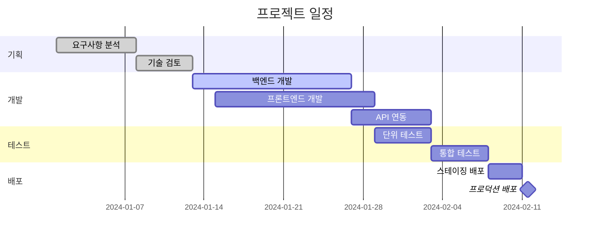

## 7. 파이 차트 (Pie Chart)

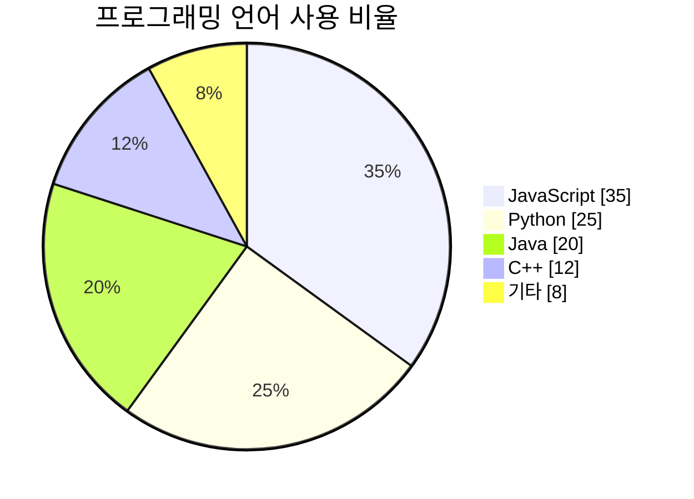

## 8. Git 그래프 (Git Graph)

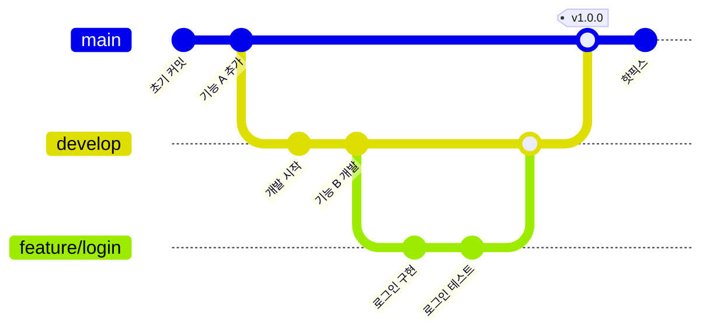

## 9. 마인드맵 (Mindmap)

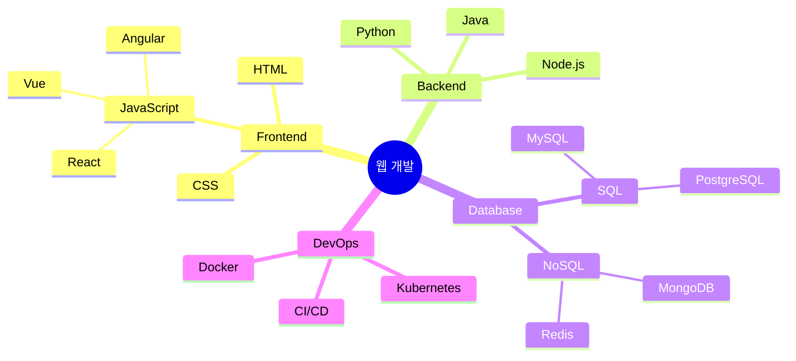

## 10. 타임라인 (Timeline)

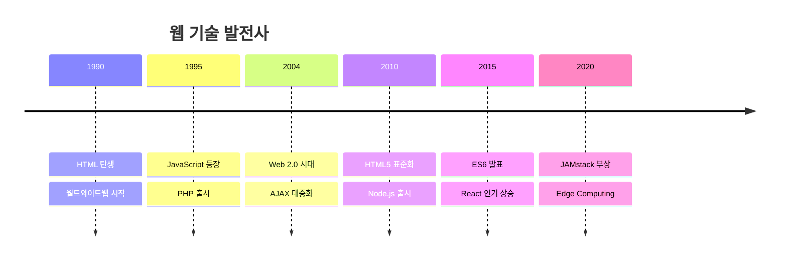

## 11. 사용자 여정 (User Journey)

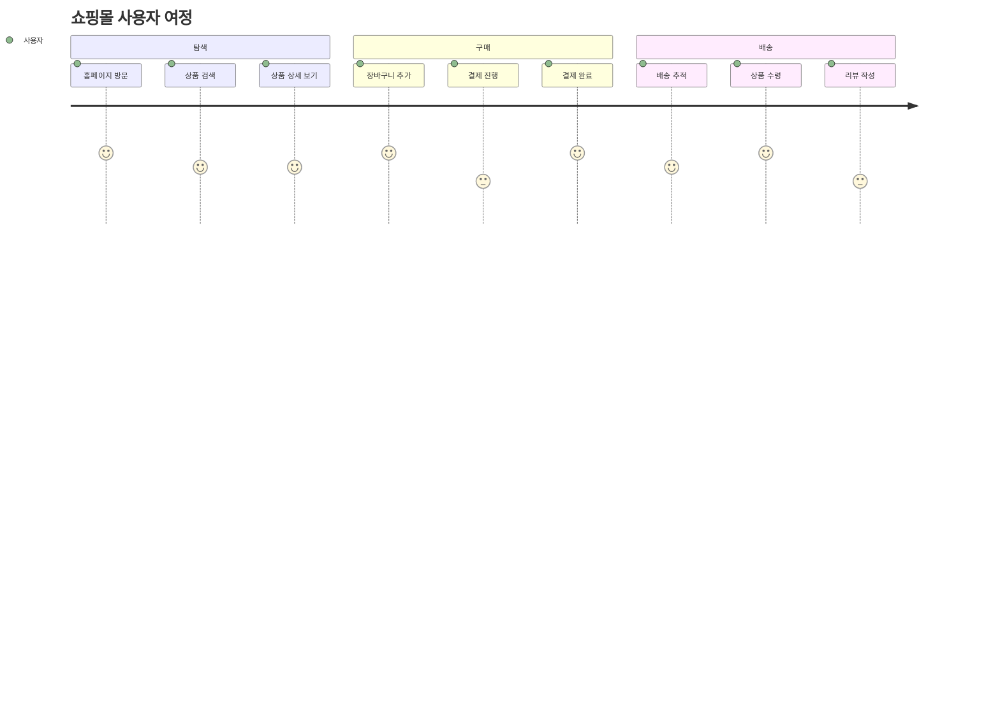

## 스타일링

### 노드 스타일 커스터마이징

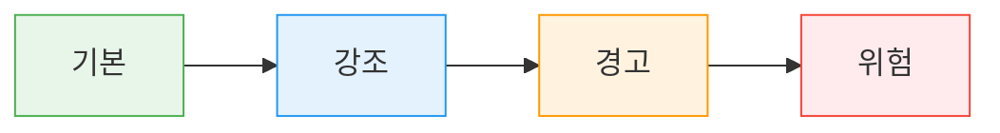

## 참고 자료

- [Mermaid 공식 문서](https://mermaid.js.org/)
- [Mermaid Live Editor](https://mermaid.live/)
- [GitHub Mermaid 지원](https://github.blog/2022-02-14-include-diagrams-markdown-files-mermaid/)

---

> **Tip:** Jekyll 블로그에서 Mermaid를 사용하려면 front matter에 `mermaid: true`를 추가하세요.
