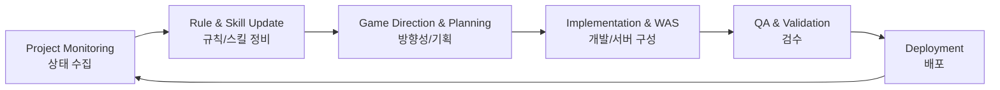

---
# the default layout is 'page'
icon: fas fa-info-circle
order: 4
---

# RS1017 프로젝트 커맨드 센터

> 여러 프로젝트를 모니터링하고, 룰/에이전트 스킬/운영 명령을 통합 관리하는 중앙 허브

---

## 프로젝트 정의

이 프로젝트는 다음을 수행합니다.

- 외부/연계 프로젝트 모니터링
- 필요한 룰, 정책, 에이전트 스킬 제공
- 게임의 방향성과 기획부터 WAS, 배포까지 전 구간 관리
- 모든 명령 흐름을 이 저장소를 통해 단일화

즉, **콘텐츠 플랫폼 + 운영 컨트롤 타워 + 자동화 명령 시스템**을 결합한 형태입니다.

---

## 핵심 기능

| 기능 | 설명 |
|------|------|
| **프로젝트 모니터링** | 연계 프로젝트의 상태/일정/리스크를 추적 |
| **룰/정책 관리** | 팀 공통 운영 기준을 문서화하고 버전 관리 |
| **에이전트 스킬 운영** | 반복 업무를 스킬/자동화 파이프라인으로 표준화 |
| **게임 라이프사이클 관리** | 방향성 → 기획 → 구현(WAS) → 테스트 → 배포를 통합 관리 |
| **명령 허브** | 실행 명령의 단일 진입점과 이력 관리 제공 |

---

## 운영 흐름

- 선순환 구조로 운영하며, 배포 결과가 다시 모니터링 단계로 연결됩니다.
- 룰/스킬은 각 단계의 품질과 일관성을 보장하는 기준 역할을 합니다.

---

## 명령 체계 원칙

1. **모든 명령은 중앙화**: 프로젝트 명령은 이 저장소 경유를 원칙으로 함
2. **정책 기반 실행**: 실행 전에 룰/정책 준수 여부를 검토
3. **자동화 우선**: 반복 가능한 업무는 에이전트 스킬로 전환
4. **이력 기반 운영**: 문서/커밋으로 변경 배경과 결과를 추적

---

## 기대 효과

- 운영 혼선 감소 (명령 채널 단일화)
- 품질 균일화 (룰/스킬 표준화)
- 일정 예측성 향상 (단계별 상태 가시화)
- 배포 안정성 개선 (검증-배포 루프 정착)

---

## Contact

- **GitHub**: [github.com/rs1017](https://github.com/rs1017)
- **Blog**: [rs1017.github.io](https://rs1017.github.io)
- **Email**: rs1017@naver.com
