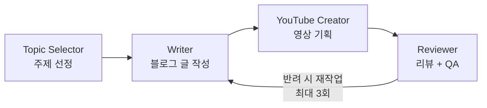

---
# the default layout is 'page'
icon: fas fa-info-circle
order: 4
---

# 낙현아빠의 개발 블로그

> 게임 서버 개발자의 IT 이야기

---

## 블로그 소개

17년차 게임 서버 개발자가 운영하는 IT 블로그입니다. 게임 서버 개발, AI, 서버 아키텍처, 데이터베이스, DevOps 등 다양한 IT 주제를 실무 경험 기반으로 다룹니다.

최근에는 **AI 에이전트 자동화 파이프라인**과 **실전 게임 서버 운영 경험**을 연결하는 콘텐츠를 집중적으로 다루고 있습니다.

---

## 주제 카테고리

| 카테고리 | 설명 |
|---------|------|
| **Server** | 게임 서버 아키텍처, 네트워크, 동시성 처리 |
| **AI** | LLM, 프롬프트 엔지니어링, AI 도구 활용 |
| **Database** | Redis, MySQL, MongoDB, 쿼리 최적화 |
| **DevOps** | CI/CD, Docker, Kubernetes, 모니터링 |
| **Architecture** | 설계 패턴, MSA, 분산 시스템 |
| **Career** | 개발자 성장, 팀 관리, 커리어 |

---

## 에이전트 기반 콘텐츠 파이프라인

블로그 콘텐츠는 AI 에이전트 파이프라인을 통해 작성됩니다.

### 1. Topic Selector (주제 선정)
- 게임서버, AI, DB, 아키텍처, DevOps 등 IT 주제 선정
- 키워드 풀 + 트렌드 기반 주제 도출
- 기존 포스트와 중복 방지

### 2. Writer (블로그 작성)
- 선정된 주제로 개발자 관점의 블로그 포스트 작성
- 실무 경험 기반의 기술 글 작성
- 실행 가능한 코드 예제 포함

### 3. YouTube Creator (유튜브 기획)
- 완성된 블로그 글을 유튜브 영상 대본/기획으로 변환
- 인트로, 본문(코드/아키텍처 설명), 아웃트로 구성
- 썸네일 텍스트, 태그, 설명란 등 메타데이터 생성

### 4. Reviewer (리뷰/QA)
- 블로그 포스트: 기술적 정확성, 가독성, 코드 품질 검토
- 유튜브 기획: 영상 흐름, 시청자 관점 검토
- **반려 시 Writer로 다시 전달 (최대 3회)**
- 승인 시 게시 진행

---

## 스케줄

| 요일 | 생성 개수 | 시작 시간 |
|------|----------|----------|
| 월-금 | 5개 | 12:00 |
| 토-일 | 50개 | 12:00 |

- Windows Task Scheduler로 자동 실행
- 모든 생성 완료 후 일괄 commit & push
- GitHub Actions로 Jekyll 빌드 및 배포

---

## 제작자

**최진호 (Jinho Choi)**

- 16년차 게임 서버 개발자
- 덱사스튜디오
- MMORPG-ProjectR 서버 개발

---

## 2026 업데이트 포인트

- 블로그 제작 파이프라인을 에이전트 기반으로 전환하여 주제 선정/작성/검수 자동화
- AI + 게임 서버 실무를 결합한 연재형 콘텐츠 강화
- 포스트 품질 향상을 위해 리뷰/QA 단계 및 재작업 루프 운영

---

## Contact

- **GitHub**: [github.com/rs1017](https://github.com/rs1017)
- **Blog**: [rs1017.github.io](https://rs1017.github.io)
- **Email**: rs1017@naver.com
